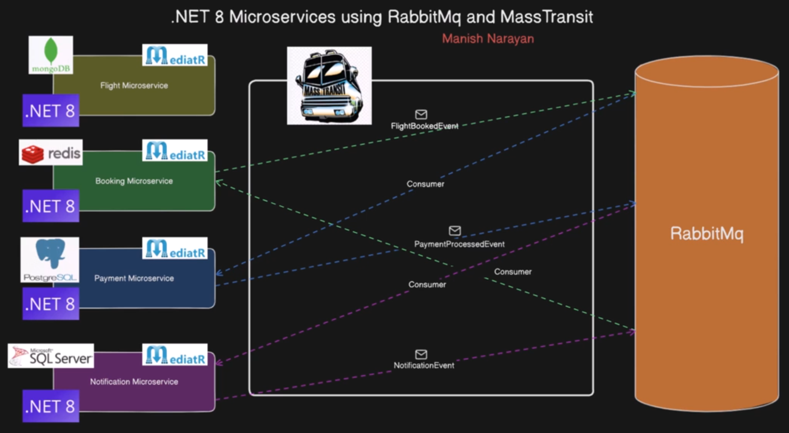

# 🚀 .NET Microservices with RabbitMQ & MassTransit

Projeto desenvolvido com base no curso:

https://www.udemy.com/course/net-8-microservices-with-rabbitmq-and-masstransit/

Além da implementação proposta no curso, o projeto foi modernizado com recursos mais atuais do ecossistema .NET, incluindo:

- ✅ Uso de **Primary Constructors** do .NET 10
- ✅ Mapeamentos utilizando **Mapster**
- ✅ Melhor organização e redução de boilerplate
- ✅ Ajustes estruturais e melhorias na arquitetura original

---

# 🏗️ Arquitetura

---

# 📚 Principais Aprendizados

Durante o desenvolvimento deste projeto foram explorados conceitos importantes como:

- Microsserviços com .NET
- Comunicação assíncrona
- Event Driven Architecture
- RabbitMQ + MassTransit
- Consumers e publicação de eventos
- Desacoplamento entre serviços
- Persistência distribuída
- Docker e containerização
- Boas práticas de arquitetura

---

# 🛠️ Tecnologias

- .NET 10
- ASP.NET Core
- RabbitMQ
- MassTransit
- Mapster
- Dapper
- SQL Server
- PostgreSQL
- MongoDB
- Redis
- Docker

---

# 👨‍💻 Objetivo

Este projeto teve como foco aprofundar conhecimentos em arquitetura de microsserviços, mensageria e comunicação distribuída utilizando o ecossistema moderno do .NET.